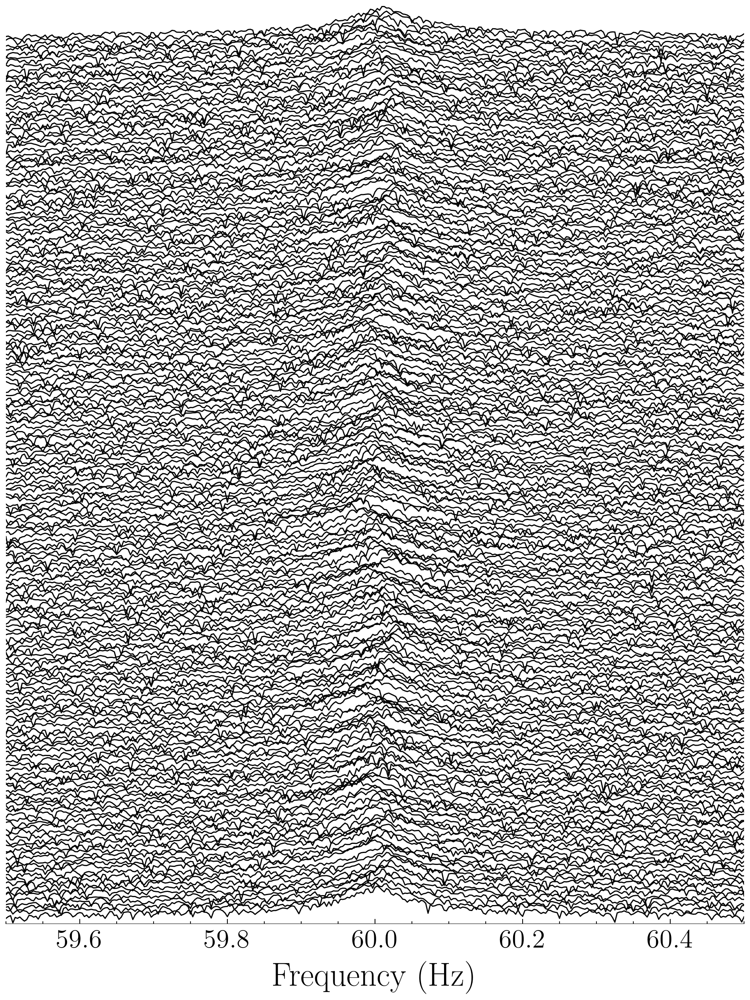

# ANC: Adaptive Noise Cancellation for LIGO Instrumental Lines

[](https://arxiv.org/abs/2412.01058)
[](https://journals.aps.org/prd/abstract/10.1103/PhysRevD.110.122004)

This repository contains the implementation of an adaptive noise cancellation (ANC) algorithm for mitigating LIGO instrumental lines, in particular the 60 Hz mains power line. The algorithm uses reference signals to estimate and remove power line interference while preserving the underlying gravitational wave signal. The method is described in detail in  ["Adaptive cancellation of mains power interference in continuous gravitational wave searches with a hidden Markov model"](https://journals.aps.org/prd/abstract/10.1103/PhysRevD.110.122004). This repository is an effort to open-source the methods described in the paper.

This repository contains `MATLAB` code used in the original paper, along with a more accessible Python implementation designed for the astrophysics community. **Please note that the Python implementation is a work in progress**. Please check the [issues](https://github.com/UniMelb-NSGW/ANC/issues) or [PRs](https://github.com/UniMelb-NSGW/ANC/pulls) for current status. 



**The Python implementation is a work in progress**

## Getting started

You can get started exploring the methods as follows


1. Clone the repository:
```bash
git clone git@github.com:UniMelb-NSGW/ANC.git
cd ANC
```

2. Create and activate the conda environment using the provided environment file:
```bash
conda env create -f conda_environment.yml
conda activate ANC
```

3. Explore `notebooks/demo.ipynb`. This notebook is the best place to start to get a sense of how to use the ANC code. The method is tested using open source data from [GWOSC](https://gwosc.org), allowing users to run the code without requiring full LIGO access

## Project Structure

```
ANC/
├── python/
│   └── ANC/
│       ├── adaptive_filters.py    # Core ARLS implementation
│       ├── generate_synthetic_data.py  # Data generation utilities
│       ├── hmm_viterbi.py        # Hidden Markov Model implementation
│       ├── evaluation.py         # Performance evaluation metrics
│       └── utils.py              # Helper functions
├── notebooks/
│   └── examples/                 # Example notebooks
└── tests/                        # Unit tests
```

## Usage

### Basic Example

```python
from ANC.adaptive_filters import arls_n
# Apply adaptive filter
cancelled, adap, fit, P = arls_n(
    primary=x,
    reference=R,
    order=10,       # Filter order
    lambd=0.99,     # Forgetting factor
    Delta=100.0     # Regularization parameter
)
```

### Jupyter Notebooks

Example notebooks demonstrating the usage of the package can be found in the `notebooks/examples/` directory. These notebooks cover:

- Basic usage of the adaptive filter
- Synthetic data generation
- Performance evaluation
- Real-world data analysis

## Documentation

Detailed documentation for each module can be found in the docstrings of the respective Python files. The main components are:

- `adaptive_filters.py`: Implements the core ARLS algorithm
- `generate_synthetic_data.py`: Utilities for generating test data
- `hmm_viterbi.py`: Hidden Markov Model implementation for state estimation
- `evaluation.py`: Metrics for evaluating filter performance
- `utils.py`: Helper functions and utilities

## Contributing

Contributions are welcome! Please feel free to submit a Pull Request.

## Citation

If you use this software in your research, please cite:

```bibtex
@article{kimpson2024adaptive,
  title={Adaptive cancellation of mains power interference in continuous gravitational wave searches with a hidden Markov model},
  author = {{Kimpson}, T. and {Suvorova}, S. and {Middleton}, H. and {Liu}, C. and {Melatos}, A. and {Evans}, R. and {Moran}, W.},
  journal={Physical Review D},
  volume={110},
  number={12},
  pages={122004},
  year={2024}
}
```

## License

This project is licensed under the MIT License - see the LICENSE file for details.
